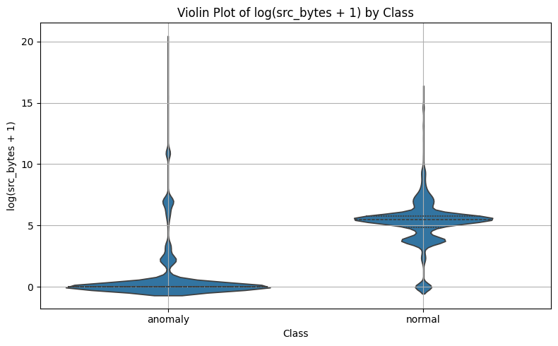
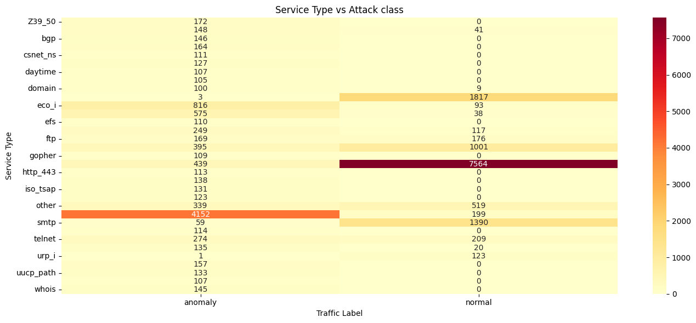
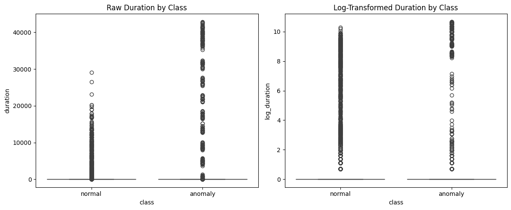

### Navigation
* [README](https://github.com/SelinaFischer/unmasking_hidden_cyber_threats_t5/blob/main/README.md)
* [ETL pipeline](https://github.com/SelinaFischer/unmasking_hidden_cyber_threats_t5/blob/main/jupyter_notebooks/1.%20etl_data_prep.ipynb)
* [EDA](https://github.com/SelinaFischer/unmasking_hidden_cyber_threats_t5/blob/main/jupyter_notebooks/2.%20eda_analysis.ipynb)
* [Hypothesis Validation](https://github.com/SelinaFischer/unmasking_hidden_cyber_threats_t5/blob/main/jupyter_notebooks/3.%20statistical_analysis.ipynb)

## Introduction:

**Unmasking Hidden Cyber Threats** is a 3-day Hackathon project. We chose this topic because cybersecurity has become one of the most critical challenges facing modern businesses. With the growing sophistication of cyber threats and increasing reliance on digital infrastructure, a single attack can paralyse operations, disrupt supply chains, and erode public trust.

In the UK alone, several high-profile organisations including M&S, Co-op, and Harrods have recently fallen victim to cyberattacks. One particularly severe incident brought M&S’s operations to a complete standstill, leaving shelves empty across stores and highlighting the deep impact these threats can have on daily business continuity.

With this in mind, our team developed *Unmasking Hidden Cyber Threats*, an exploratory data project that applies statistical analysis and AI-enhanced storytelling to uncover patterns in network activity that may indicate malicious behaviour.

Through a clean ETL pipeline, validated hypotheses, and an interactive dashboard built with a **Streamlit app**, the project delivers actionable insights to support early threat detection and faster incident response. Our goal is to empower stakeholders to proactively identify anomalies rather than rely solely on manual detection or reactive defence.

## Objectives

The primary objectives of this project are to:

### 1. Detect Patterns Behind Cyber Threats
Analyse historical network traffic to uncover patterns and behaviours associated with intrusion attempts and anomalies.

### 2. Validate Data-Driven Hypotheses
Use statistical testing (Mann-Whitney U, Chi-square, T-test) to verify relationships between connection attributes (e.g. duration, service, flag) and attack types.

### 3. Build a Predictive Model for Intrusion Detection
Develop and evaluate a classification model to distinguish between normal and malicious connections using features from the dataset.

### 4. Deliver Actionable Insights via Interactive Dashboard
Design an intuitive Tableau/Streamlit dashboard that allows users to filter, visualise, and explore threat types, feature relationships, and anomaly trends.

### 5. Demonstrate AI-Enhanced Analytics
Leverage AI tools (e.g. ChatGPT) for code generation, explanation, debugging, and and insight-driven storytelling.

### 6. Promote Cybersecurity Awareness
Translate technical insights into business-friendly recommendations that highlight the importance of early threat detection and data-driven defence strategies.

## Dataset Content
We used the **Network Intrusion Detection** dataset from Kaggle, which contains over 48,000 records of simulated TCP/IP network connections. The dataset is split into two files:

| Dataset         | Rows   | Columns | Label Column | Purpose                                           |
|-----------------|--------|---------|---------------|---------------------------------------------------|
| Train_data.csv  | 25,192 | 42      | `class`       | Used for hypothesis testing and model training    |
| Test_data.csv   | 22,544 | 41      | *(None)*      | Used for prediction and performance evaluation    |

Each connection record includes **41 features**, both numeric and categorical, describing network behaviour such as:

- Numerical features like `duration`, `src_bytes`, `dst_bytes`
- Categorical features like `protocol_type`, `service`, `flag`
- Statistical indicators like `same_srv_rate`, `rerror_rate`, and `dst_host_count`

*Check [glossary](#glossary-of-feature-names) to see the explanation of terminology*

The `class` label in the training data specifies whether a connection is **normal** or a known **attack type** (e.g. `neptune`, `smurf`, `satan`).

This structure supports both:

- **Hypothesis testing** to detect behavioural differences between normal and attack traffic
- **Predictive modelling**, where we train a classifier on labelled data and evaluate it on unseen test data to simulate real-world threat detection

**Data source**: [Kaggle – Network Intrusion Detection](https://www.kaggle.com/datasets/sampadab17/network-intrusion-detection/data)

## Business Requirements

- Identify suspicious patterns in network traffic for early threat detection  
- Classify connections as normal or anomalous based on their behavior  
- Equip security analysts with a visual, interactive dashboard to support investigation and response  
- Reduce reliance on manual pattern recognition by surfacing statistically validated indicators  

 

## Hypothesis and how to validate?

### Hypothesis Validation

### Objectives

The objective of hypothesis validation in this project is to apply statistical testing to uncover meaningful behavioural differences between normal and malicious network traffic. This helps identify patterns that could improve early threat detection and support cybersecurity decision-making.

- **Detect Statistical Differences:**  
  Quantify whether key features (such as `src_bytes` or `duration`) show significant differences between normal and malicious traffic.

- **Identify Risk-Associated Attributes:**  
  Determine whether certain categorical features (such as service type) are disproportionately linked to malicious activity.

- **Validate Hypotheses with Statistical Rigor:**  
  Use appropriate hypothesis tests (e.g. Mann-Whitney U, Chi-square, T-test) to ensure findings are statistically valid and not due to random chance.

- **Support Explainable Insights:**  
  Back statistical results with visualisations (e.g. boxplots, heatmaps) to help non-technical stakeholders understand threat patterns.

- **Inform Detection Logic:**  
  Use validated hypotheses to inform detection rules, classification models, or security monitoring strategies.

---

### Hypothesis 1: Malicious traffic has significantly higher src_bytes than normal traffic

- **Null Hypothesis (H₀):** No difference in `src_bytes` between malicious and normal traffic.  
- **Alternative Hypothesis (H₁):** Malicious traffic has higher `src_bytes`.

**Test Used:**  
Mann-Whitney U test (non-parametric, one-tailed)

**Result:**  
- U-Statistic = 16,002,447.50  
- p-value = 1.00000  
- Conclusion: **Fail to reject H₀**

**Interpretation:**  
There is no significant evidence that malicious traffic sends more data. In fact, visualisation (boxplot and violin plot) suggests the opposite—malicious connections typically have *lower* `src_bytes`, with many near zero. This feature is not a strong indicator of attack behaviour in this dataset.

---

### Hypothesis 2: Certain service types are more vulnerable to cyberattacks

- **Null Hypothesis (H₀):** No association between service type and whether the traffic is normal or malicious.  
- **Alternative Hypothesis (H₁):** A significant association exists.

**Test Used:**  
Chi-Square Test of Independence (on filtered service counts > 100)

**Result:**  
- Chi-square = 16,903.69  
- Degrees of Freedom = 32  
- p-value = 0.0000  
- Conclusion: **Reject H₀**

**Interpretation:**  
There is a strong statistical association between service type and attack likelihood. Services like `smtp`, `ftp`, `telnet`, and `private` have high anomaly counts. Some legacy services (e.g. `uucp`, `nnsp`) show a 100% anomaly rate, indicating they are exclusive to attack traffic in this dataset.

**Recommendation:**  
Monitor and restrict high-risk service types. Audit legacy services and deprecate if not needed.

---

### Hypothesis 3: Malicious connections tend to have shorter durations than normal ones

- **Null Hypothesis (H₀):** No difference in connection duration.  
- **Alternative Hypothesis (H₁):** Malicious connections are shorter.

**Tests Used:**
- **T-test (Welch’s, one-tailed)** on log-transformed duration  
- **Mann-Whitney U test** (non-parametric, one-tailed)  

**Results:**
| Test                     | Statistic         | p-value  | Conclusion         |
|--------------------------|------------------|----------|--------------------|
| Shapiro-Wilk (Normality) | Non-normal (both) | —        | Used non-parametric |
| Levene’s Test (Variance) | p = 0.0000        | —        | Unequal variances   |
| T-Test                   | t = -11.29        | 0.0000   | Reject H₀           |
| Mann-Whitney U           | U = 72,505,755.5  | 0.0000   | Reject H₀           |

**Interpretation:**  
Both statistical tests confirm that malicious connections tend to be shorter. Boxplots and log-transformed duration visualisations support this. This insight can be used to inform intrusion detection logic.

### Summary of Hypothesis Results

| Hypothesis | Feature Tested        | Test Used            | Result                | Conclusion                          |
|------------|-----------------------|-----------------------|------------------------|--------------------------------------|
| H1         | `src_bytes`           | Mann-Whitney U        | p = 1.0000             | Not Supported                        |
| H2         | `service` type        | Chi-square            | p < 0.0001             | Supported                            |
| H3         | `duration`            | T-test, Mann-Whitney  | p < 0.0001 (both)      | Supported                            |

 

## Project Plan

This project followed a structured, collaborative 4-day plan to investigate hidden patterns in network traffic data and build an interactive dashboard that supports cybersecurity insights. Below is a summary of our approach, data management process, and methodology choices.

## High-Level Steps

| **Day** | **Focus Area**                         | **Key Activities**                                                                                                                                                 |
|---------|----------------------------------------|--------------------------------------------------------------------------------------------------------------------------------------------------------------------|
| Day 1   | Problem Framing & Data Prep            | - Defined project objectives and key hypotheses - Assigned team roles - Reviewed & cleaned train/test datasets - Performed initial EDA & profiling - Set up GitHub repo & Kanban board |
| Day 2   | Analysis & Hypothesis Testing          | - Conducted descriptive statistics - Ran Mann‑Whitney U, Chi‑square & t‑tests - Explored patterns in service types, durations & feature distributions - Drafted Streamlit dashboard wireframes |
| Day 3   | Predictive Modelling & Dashboard Build | - Built binary classification model to detect anomalies - Evaluated accuracy & precision - Developed interactive Streamlit dashboard - Summarised key findings & insights |
| Day 4   | Final Touch & Presentation             | - Rehearsed final presentation                                                                                                                                    |

 

## Data Management Process

Throughout the project, we applied a structured and disciplined approach to managing data:

- **Collection**: We used the publicly available *Network Intrusion Detection* dataset from Kaggle, which includes over 48,000 TCP/IP connection records split into training and test sets.

- **Processing**: The dataset was cleaned by checking for null values, removing duplicates and unneccesary columns, converting categorical features, addressing variable imbalance, and applying log transformations to skewed fields.

- **Analysis**: We conducted Exploratory Data Analysis (EDA) to understand feature distributions, detect outliers, correlation heatmap, and guide the formation of hypotheses related to malicious versus normal network behaviour.

- **Interpretation**: Insights were developed through visual sketches, refined using Tableau, and presented in a Streamlit dashboard. Key findings were communicated through storytelling and supported in the final report.

## Methodology Rationale

We selected the following methodologies for analytical robustness and practical applicability:

- **Descriptive Statistics**: Provided a foundational understanding of the dataset and guided further analysis.
- **Mann-Whitney U Test**: Chosen due to non-normal distribution of continuous features like `duration` and `src_bytes`.
- **Chi-square Test**: Used to detect associations between categorical features (e.g., service types) and attack presence.
- **T-test with log-transformation**: Applied where features showed skewness but approximate normality after transformation.
- **Predictive Modelling**: A binary classifier was used to simulate anomaly detection based on statistically significant features, supporting actionable recommendations for security teams.
- **Dashboarding with Streamlit**: Provided an accessible, browser-based interface to explore traffic behaviour and test hypotheses interactively. Streamlit allowed us to integrate statistical summaries, filters, and visualisations into a single application that supports both technical and non-technical users.

Each method was selected to ensure our findings were statistically valid, explainable to stakeholders, and suitable for supporting early threat detection use cases.

##  Workflow & Analysis Techniques Used

### Data Collection & Cleaning
- Imported and inspected raw CSV files from Kaggle.
- Ensured schema consistency and handled duplicates and missing values.
- Normalised features and prepared a clean dataset for analysis and modelling.

### Feature Engineering
- Created derived variables (e.g. log-transformed features).
- Grouped high-cardinality categories to improve clarity and model compatibility.
- Structured the data to support both statistical testing and dashboard visualisation.

### Exploratory Data Analysis (EDA)
- Used descriptive statistics and plots to explore feature behaviour.
- Identified patterns and anomalies that informed hypothesis design.

### Hypothesis Validation
- Applied formal statistical tests:
  - **Mann-Whitney U** for non-parametric comparisons
  - **Independent T-test** for log-transformed duration
  - **Chi-square** for categorical service-feature associations
- Confirmed or rejected assumptions about behavioural differences between malicious and normal traffic.

### Dashboard Design & Interactivity
- Developed a user-friendly, multi-tab **Streamlit** dashboard.
- Implemented dynamic filters and layered visuals to allow interactive exploration of threats and trends.

### AI Integration & Support
- Used **ChatGPT** to accelerate prototyping, debug code, improve narrative framing, and generate supporting assets (e.g. visuals and markdown).
- Applied AI for storytelling enhancement, syntax checking, and ideation.

### Documentation & Project Tracking
- Documented key design decisions, challenges, and iterations throughout the process.
- Used GitHub for version control and Kanban board for team task management and progress tracking.

### Final Presentation
- Delivered a structured walkthrough presentation covering insights, statistical methodology, and dashboard demo.
- Supported delivery with clear visuals, key takeaways, and actionable findings.

 

## Rationale to Map Business Requirements to Visualisations

| **Business Requirement**      | **Mapped Visualisation Feature**                                                               |
|------------------------------|-------------------------------------------------------------------------------------------------|
| Identify anomalies           | Boxplots and violin plots comparing `duration` and `src_bytes` across traffic classes           |
| Compare network features     | Violin plots and distribution plots for continuous variables to highlight spread and skewness   |
| Spot vulnerable services     | Bar chart: `service` vs `class` (normal vs malicious)                                           |
| Support pattern recognition  | Heatmap showing correlation between numerical features                                          |
| Segment by protocol          | Sidebar filters for `protocol_type`, `flag`, and `service` to enable interactive segmentation   |

## Limitations

- No timestamps – time-based trends unavailable  
- High cardinality in `service` column – grouped infrequent categories  

## Ethical Considerations

- Dataset is synthetic with no personal data  
- Considered implications of false positives and detection risk  
- Addressed potential bias in service-type association  
- Communicated uncertainty and ensured interpretability  
 

## Findings, Recommendations and Conclusion

In this project, the term **class** refers to the label assigned to each network connection in the dataset:
- **Normal**: Legitimate, benign activity  
- **Anomaly**: Suspicious or malicious behaviour (e.g. scanning, probing, denial-of-service)

These class labels are the foundation for our entire analysis. By comparing how key features behave across these two classes, we sought to identify reliable indicators of cyber threats and inform detection strategies.

###  What Did We Find?

We began with a simple question:  
**Can patterns in network behaviour reveal early signs of a cyberattack?**

To answer this, we formulated hypotheses, validated them with statistical tests, and interpreted the results using visuals and correlations. Here's what we uncovered:

###  Hypothesis 1:  

**“Malicious traffic has significantly higher `src_bytes` than normal traffic.”**  
- **Result**: ❌ **Rejected**  
- **What we saw**: Many malicious records had **very low source bytes**, contradicting the assumption that attackers always send more data.  
- **Impact**: `src_bytes` is not a strong standalone signal for identifying threats.

---

### Hypothesis 2:  
**“Certain service types are more vulnerable to cyberattacks.”**  
- **Result**: ✔️ **Accepted**  
- **What we saw**: Services like **‘private’**, **‘eco_i’**, and **‘ecr_i’** were disproportionately associated with anomalies.  
- **Impact**: Service type can be used as a risk factor — security systems should flag high-risk services for closer inspection.

---

### Hypothesis 3:  
**“Malicious connections tend to have shorter durations than normal ones.”**  
- **Result**: ✔️ **Accepted**  
- **What we saw**: Using T-tests and Mann-Whitney U tests on log-transformed data, we confirmed that anomalies often involve **brief, rapid-fire connections** consistent with scans and probes.  
- **Impact**: Duration thresholds can help detect suspicious behaviour early.

---

###  Correlation Insights  
Beyond the hypotheses, we examined feature correlations with `class` labels. Some features stood out:

| 🔝 Strong Positive Correlations (linked to anomalies) | 🔽 Strong Negative Correlations (linked to normal) |
|--------------------------------------------------------|----------------------------------------------------|
| `dst_host_srv_serror_rate` (0.65)                      | `same_srv_rate` (–0.75)                           |
| `serror_rate`, `srv_serror_rate` (≈ 0.65)              | `logged_in` (–0.69)                               |
| `count` (0.58)                                         | `dst_host_same_srv_rate` (–0.69)                  |

- **Visuals confirmed**: Error rates for anomalies spike toward 1.0, while normal traffic stays near 0.  
- **Takeaway**: Repeated failed connections and service errors are red flags.

###  Top 5 High-Risk Services

Based on frequency and anomaly ratios, the following **five services** were found to have a **100% anomaly rate** — meaning **every single connection** using these services was flagged as **malicious**.

These services represent the highest-risk categories in the dataset and should be treated as strong indicators of cyber threats in any network monitoring system.

| Service Name | Description                                         |
|--------------|----------------------------------------------------------------------------|
| `nnsp`       | Network News Server Protocol (obsolete Usenet-related service)            |
| `supdup`     | Obsolete remote terminal protocol                                         |
| `uucp`       | Unix-to-Unix Copy Protocol — legacy file transfer method                  |
| `uucp_path`  | Variation of UUCP path (legacy Unix routing path)                         |
| `vmnet`      | Virtual machine network interface protocol (may indicate virtualised probes or testing tools) |

### Interpretation:
- These services are mostly **legacy, obscure, or virtualised protocols** that are **not commonly used in modern production environments**.
- Their presence could suggest:
  - Misconfigured or unmonitored legacy systems
  - Virtualised environments running attack simulations
  - Vulnerability scanners or exploit frameworks mimicking outdated service behaviour

They are strong candidates for **automatic alerting or high-severity flagging** in real-time intrusion detection systems.

 

##  Recommendations

1. **Use High-Impact Features for Detection**
   - Prioritise `serror_rate`, `srv_serror_rate`, and `count` in both ML models and rule-based systems.
   - Drop low-value features (e.g. `urgent`, `num_file_creations`) to streamline performance.

2. **Monitor High-Risk Services**
   - Set alerts for traffic targeting high-risk services (`private`, `eco_i`), even if other features look benign.

3. **Deploy Duration-Based Rules**
   - Use short duration + high error rate as a compound indicator of scanning or DoS attempts.

4. **Set Thresholds for Real-Time Alerts**
   - Trigger alerts when:
     - `serror_rate > 0.9`
     - `dst_host_srv_serror_rate > 0.9`

5. **Guide Model Building with Evidence**
   - Use correlation analysis to inform feature selection in anomaly detection models.
   - Validate model assumptions with exploratory data testing just as we did in this project.

##  Conclusion

This project set out to uncover hidden patterns behind cyberattacks  and delivered actionable, explainable insights.

Through a structured process of hypothesis testing, statistical validation, and visual exploration, we found that **short durations, specific service types, and spiked error rates** are the strongest behavioural signatures of malicious activity.

Not all assumptions were confirmed (e.g. `src_bytes`), but that’s the power of data.  It helps challenge intuition with evidence.

These findings can directly support:
- **Smarter rule-based detection** in security tools  
- **Feature engineering** for machine learning models  
- **Early-warning alerts** to prevent damage from undetected intrusions

By unmasking these subtle but critical indicators, our project brings organisations one step closer to proactive, data-driven cybersecurity.

 

##  Reflection

This project marks the final milestone of our 4-month **Data Analytics & AI Bootcamp**, a journey that has been both intense and transformative. Over the course of the programme, we immersed ourselves in practical learning through **three Hackathons** and a **Capstone project**, applying new concepts in real-world scenarios under tight deadlines.

When we signed up for this course, our goal was clear to challenge ourselves, learn something new, and gain hands-on skills that we could confidently use in professional settings. We’re proud to say that we’ve achieved that goal. Across all four projects, we demonstrated a strong ability to turn complex data problems into actionable insights with clarity, technical rigor, and purpose.

For this final Hackathon, we named our team **Cyber Ninjas**, a name that reflects our mindset as data professionals. Like ninjas, we aimed to be sharp, focused, and quietly effective. And just as ninjas are trained to adapt and overcome in high-pressure situations, we were ready to face any challenge head-on in the world of cybersecurity and analytics.

That mindset was tested when, despite being a group of four, only two of us actively contributed to the delivery. While it was disappointing to lack full team participation, it became a powerful moment for us to demonstrate professionalism and commitment.

We also faced some early technical challenges, including version control conflicts and delays in getting our environment aligned. This added extra pressure to our progress, especially with such a tight timeframe. However, we tackled these obstacles head-on, resolved the blockers collaboratively, and kept the project moving forward.

We adapted quickly, redistributed the workload, and stayed focused on quality, delivering the full scope of a four-person project in just three days with two dedicated team members. We are proud of how we handled the situation with resilience, ownership, and a drive to deliver the best possible outcome under pressure.

This experience reinforced the importance of accountability, adaptability, and collaboration. These are skills that are just as essential as technical expertise in the data field. As we close this chapter, we do so with pride, knowing we have pushed ourselves, grown tremendously, and produced work we stand behind.

This bootcamp has not only equipped us with new tools and techniques, it has built the confidence and mindset to continue learning, solving problems, and delivering value as future data professionals.

 

---

## Dashboard Design

We independently prototyped our ideas and designs, walked through each other’s work to provide feedback, and then merged two Streamlit apps into a single, cohesive dashboard with tabs for Project Overview, KPIs, Visualizations, Statistical Tests, Predictive Model and Glossary. The dashboard features interactive Plotly and Seaborn/Matplotlib charts, customizable sidebar filters, high‑level metric cards and plain language summaries for non‑technical users, and detailed tables and code snippets for technical audiences.

## Development Roadmap
As two contributors handling what would be a four‑person workload, we condensed our scope to deliver core features quickly. Our feedback sessions identified UX and code‑architecture refinements that we were unable to implement in time. In future work we will address those refinements and incorporate further enhancements based on user feedback.

## Deployment
#### Streamlit 

* Streamlit Dashboard live link is: https://cyberninjas.streamlit.app/ 
* The project was deployed to Streamlit Community Cloud using the following steps.

1. Log in to Streamlit Community Cloud and create an App
2. From the Deploy tab, select GitHub as the deployment method.
3. Select the repository name and click Search. Once it is found, click Connect.
4. Select the branch you want to deploy, then click Deploy Branch.
5. The deployment process should happen smoothly 

## Streamlit Interactive Dashboard

Explore the interactive Unmasking Hidden Cyber Threats dashboard here:

https://cyberninjas.streamlit.app/ 

---

## Main Data Analysis Libraries

Throughout this project, we used a combination of Python libraries for data cleaning, analysis, statistical testing, and visualisation. Below is a summary of the core libraries used and how we applied them:

| Library        | Purpose / Usage Example                                                                 |
|----------------|------------------------------------------------------------------------------------------|
| `pandas`       | Data manipulation and filtering (e.g. loading CSVs, grouping data by service type)      |
| `numpy`        | Numerical operations and array processing (e.g. calculating anomaly ratios)              |
| `matplotlib`   | Data visualisation (e.g. plotting feature distributions and boxplots)                    |
| `seaborn`      | Statistical visualisation (e.g. heatmaps, violin plots, and pair plots for EDA)         |
| `scipy.stats`  | Hypothesis testing (e.g. Mann-Whitney U, Chi-square, T-test on duration and service)    |
| `sklearn`      | Train/test split for ML preparation and feature correlation analysis                    |
| `plotly`       | Interactive visuals (e.g. bar charts with hover info for service-level anomaly counts)  |
| `streamlit`    | Dashboard framework (e.g. displaying charts, filters, and <**fill in detail here**> )  |

These tools enabled us to uncover patterns in network traffic, test hypotheses statistically, and present the findings interactively.

---

##  Credits

- The base README structure was adapted from the **Code Institute Data Analytics Project Template**.
- Code logic and dashboard interaction patterns were informed by materials from the **Code Institute LMS – Data Analytics & AI** modules.

##  Acknowledgements

This project was made possible through the use of the following resources, tools, and platforms:

- **Network Intrusion Detection Dataset**  
  Provided by Sampada Bhosale on Kaggle  
  [Link to dataset](https://www.kaggle.com/datasets/sampadab17/network-intrusion-detection)

- **OpenAI ChatGPT**  
  Used extensively for ideation, troubleshooting, code optimisation, suggestions, review, and generating the project cover image  
  [chat.openai.com](https://chat.openai.com)

- **Streamlit Community Cloud**  
  Deployment guidance was supported by the tutorial: *“How to deploy a Streamlit app on Community Cloud”*

We would also like to thank:

- **Our instructors and mentors** at Code Institute for their consistent guidance and encouragement throughout this bootcamp.
- **Our teammates** who supported each other, contributed valuable ideas, and helped complete this Hackathon with a shared sense of ownership.

---

##  Glossary of Feature Names

This table explains the technical features and service labels found in the dataset. It is intended to help readers without a cybersecurity background understand the meaning behind each variable.

###  Key Technical Features

| Feature Name                  | Description                                                                                   |
|------------------------------|-----------------------------------------------------------------------------------------------|
| `duration`                   | Length of the network connection (in seconds)                                                 |
| `protocol_type`              | Network protocol used (e.g. `tcp`, `udp`, `icmp`)                                             |
| `service`                    | Network service on the destination port (e.g. `http`, `ftp`, `private`)                       |
| `flag`                       | Status of the connection based on TCP handshake outcomes                                      |
| `src_bytes`                  | Number of data bytes sent from source to destination                                          |
| `dst_bytes`                  | Number of data bytes sent from destination to source                                          |
| `land`                       | Boolean indicating if source and destination IP/port are the same (`1` = yes)                 |
| `wrong_fragment`             | Number of incorrect packet fragments                                                          |
| `urgent`                     | Number of urgent packets (typically used in TCP attacks)                                      |
| `hot`                        | Number of suspicious activities such as key file access                                       |
| `num_failed_logins`          | Number of failed login attempts                                                               |
| `logged_in`                  | User successfully logged in (`1` = yes, `0` = no)                                             |
| `num_compromised`            | Number of compromised conditions                                                             |
| `root_shell`                 | Whether root shell was obtained                                                              |
| `su_attempted`               | Attempts to use the `su` command                                                              |
| `num_root`                   | Number of root accesses                                                                       |
| `num_file_creations`        | Number of file creation operations                                                            |
| `num_shells`                 | Number of shell prompts invoked                                                              |
| `num_access_files`           | Number of attempts to access control files                                                   |
| `is_guest_login`             | Indicates if the login was a guest session (`1` = guest)                                      |
| `count`                      | Number of connections to the same host in the past 2 seconds                                 |
| `srv_count`                  | Number of connections to the same service in the past 2 seconds                              |
| `serror_rate`                | % of connections with SYN errors (failed connection attempts)                                |
| `srv_serror_rate`            | % of connections to the same service with SYN errors                                         |
| `rerror_rate`                | % of connections with REJ (reject) errors                                                    |
| `srv_rerror_rate`            | % of connections to the same service with REJ errors                                         |
| `same_srv_rate`              | % of connections to the same service                                                         |
| `diff_srv_rate`              | % of connections to different services                                                       |
| `srv_diff_host_rate`         | % of connections to different hosts using the same service                                   |
| `dst_host_count`             | Number of connections to the destination host                                                |
| `dst_host_srv_count`         | Number of connections to the same service on the destination host                            |
| `dst_host_same_srv_rate`     | % of connections to the same service on the same host                                        |
| `dst_host_diff_srv_rate`     | % of connections to different services on the same host                                      |
| `dst_host_same_src_port_rate`| % of connections from the same source port                                                   |
| `dst_host_srv_diff_host_rate`| % of connections to the same service but different hosts                                     |
| `dst_host_serror_rate`       | % of connections to the host that had SYN errors                                             |
| `dst_host_srv_serror_rate`   | % of same-service connections to the host that had SYN errors                                |
| `dst_host_rerror_rate`       | % of connections to the host that had REJ errors                                             |
| `dst_host_srv_rerror_rate`   | % of same-service connections to the host that had REJ errors                                |
| `log_src_bytes`              | Log-transformed value of `src_bytes` to normalize skewed data                                |
| `class`                      | Connection label: `normal` = legitimate, `anomaly` = malicious                               |

[🔝 Back to Top](#)
